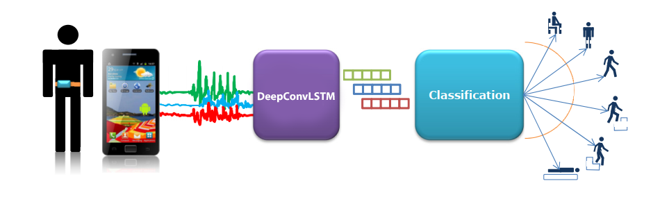
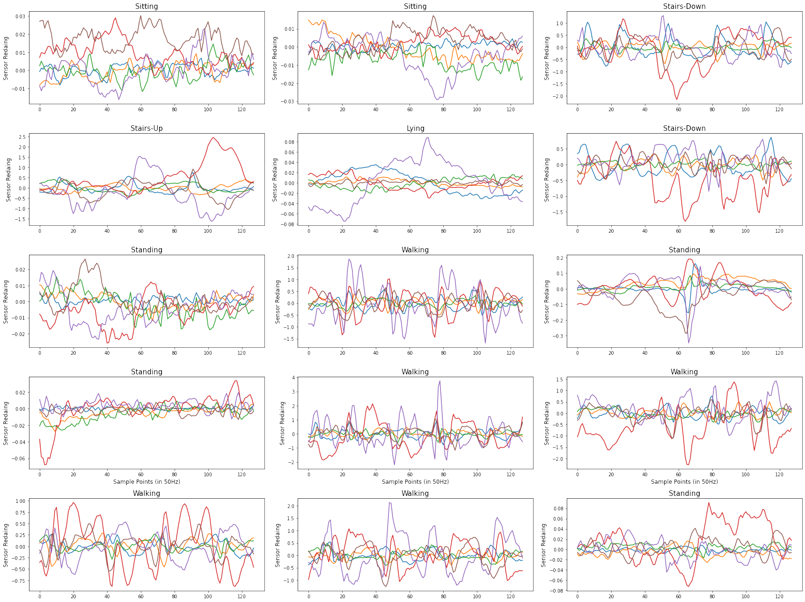
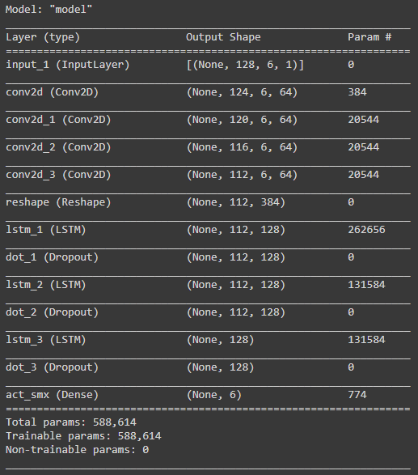

# Human Activity Recognition with DeepConvLSTM

This project presents a general deep framework for activity detection based on convolutional and LSTM recurrent units, which: 
* is suitable for multimodal wearable sensors.
* can perform sensor fusion naturally.

### **Dataset**

Dataset taken from [HAR Dataset](https://archive.ics.uci.edu/ml/datasets/Human+Activity+Recognition+Using+Smartphones) where Accelerometer and gyroscope tri-axial sensor data were
collected from 30 volunteer subjects who performed six different
activities while the smartphone was in their pockets.
These sensor data were sampled at a rate of 50 Hz, and were
separated into windows of 128 values, with 50% overlap;
the 128-real value vector stands for one example for one
activity (for each acc and gyro axis). There are a total of 7352
examples for the training data (from 21 randomly selected
subjects), and 2947 examples for the test data (from the
remaining 9 subjects).

* WALKING - 1
* CLIMBING UP THE STAIRS - 2
* CLIMBING DOWN THE STAIRS - 3
* SITTING - 4
* STANDING - 5
* LAYING - 6

### **DeepConvLSTM Model**

The model combines convolutional and recurrent layers. The convolutional layers act as feature extractors and provide abstract
representations of the input sensor data in feature maps. The
recurrent layers model the temporal dynamics of the activation
of the feature maps.

### **Result Analysis**

Reference | Model | Accuracy
-----| ------- | -------------
[Paredes et al.](https://ueaeprints.uea.ac.uk/id/eprint/73161/) | SVM | 96.40
[Reiss et al.](https://www.diva-portal.org/smash/record.jsf?pid=diva2:646274) | AdaBoost | 94.33
[Yang, Jianbo, et al.](https://www.aaai.org/ocs/index.php/IJCAI/IJCAI15/paper/viewPaper/10710) | CNN | 85.10
[Zhao, Yu, et al.](https://www.hindawi.com/journals/mpe/2018/6568519/) | Deep-Res-Bidir-LSTM | 90.20
Ours | DeepConvLSTM | 98.45

